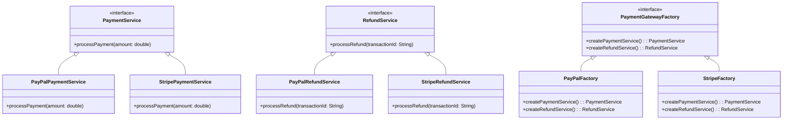

## 🏗️ The Abstract Factory Pattern: Crafting Families of Objects Like a Pro!

### *🍫 Why Abstract Factory?*

*Imagine you’re designing a premium gift box, and each box has a set of items—chocolates, drinks, and decorations. 
But here’s the twist: each box is themed! 🎁  
A “Christmas” box has candy canes, hot cocoa, and snowflakes, while a “Birthday” box has cake pops, lemonade, and balloons. 🎉 
Would you manually pick each item for every theme?  
No way! The Abstract Factory Pattern swoops in to save the day!*

*It provides a way to create families of related objects without specifying their exact class. Now you can generate entire themed collections with a single factory call! 🎨*

### 🦸‍♀️ The Abstract Factory Superpower

The Abstract Factory Pattern allows you to create a series of related or dependent objects without knowing their specific types. Here’s what makes it legendary:

    • Family Consistency: Ensures that objects created within a factory are all compatible with each other. Imagine always getting perfectly matching sets of furniture for your virtual house! 🛋️
    • Interchangeability: Easily swap one family of objects with another. Need to switch from “Modern” to “Victorian” style furniture? Just switch the factory—no code rewiring needed! 🔄
    • Loose Coupling: Your client code doesn’t need to know the details of how objects are created. It simply works with interfaces, making your code flexible and resilient to changes. 📦

---
#### 💻 Example

*here is an illustration of abstract factory pattern*

The use case focuses on supporting multiple payment gateways (like PAYPAL and STRIPE) where each gateway provides specific implementations for two key services:

	1.	PaymentService: Handles payment processing.
	2.	RefundService: Handles refund processing.

The Abstract Factory Pattern is used to ensure that related services (e.g., payment and refund) are grouped together for each gateway, allowing for easy extensibility as new gateways are added.

Interfaces:
- *[PaymentService.java (interface)](/dp-abstract-factory/src/main/java/com/absolute/bonkers/abstractfactory/PaymentService.java)* 
- *[RefundService.java (interface)](/dp-abstract-factory/src/main/java/com/absolute/bonkers/abstractfactory/RefundService.java)* 
- *[PaymentGatewayFactory.java (interface)](/dp-abstract-factory/src/main/java/com/absolute/bonkers/abstractfactory/factories/PaymentGatewayFactory.java)* 

Factories:
- *[PaypalFactory.java](/dp-abstract-factory/src/main/java/com/absolute/bonkers/abstractfactory/factories/PaypalFactory.java)* 
- *[StripeFactory.java](/dp-abstract-factory/src/main/java/com/absolute/bonkers/abstractfactory/factories/StripeFactory.java)* 

Services:
- *[PaypalPaymentService.java](/dp-abstract-factory/src/main/java/com/absolute/bonkers/abstractfactory/paypal/PaypalPaymentService.java)* 
- *[PaypalRefundService.java](/dp-abstract-factory/src/main/java/com/absolute/bonkers/abstractfactory/paypal/PaypalRefundService.java)* 
- *[StripePaymentService.java](/dp-abstract-factory/src/main/java/com/absolute/bonkers/abstractfactory/stripe/StripePaymentService.java)* 
- *[StripeRefundService.java](/dp-abstract-factory/src/main/java/com/absolute/bonkers/abstractfactory/stripe/StripeRefundService.java)* 

Test Class:
- *[PaymentProcessServiceTest.java](/dp-abstract-factory/src/test/java/com/absolute/bonkers/abstractfactory/PaymentProcessServiceTest.java)* 

*Class diagram below of the use-case*

### 🌈 Summary

*In the world of software design, the Abstract Factory Pattern is your go-to for creating consistent and interchangeable families of objects. 
Whether you’re building complex user interfaces, game worlds, or product kits, Abstract Factory keeps your object creation elegant, modular, and adaptable to change. 
So, whenever you’re crafting systems where products come in themed sets, remember the Abstract Factory Pattern to keep things consistent and future-proof! 🏆✨*